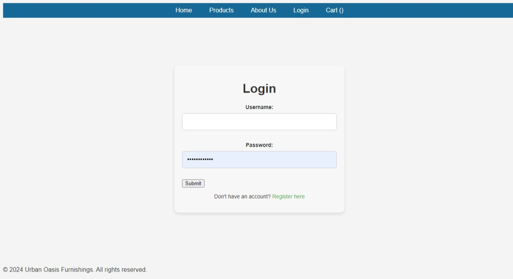

# Urban_Oasis_Furnishings

Urban Oasis Furnishings is a custom e-commerce platform built using Django for selling furniture. It allows users to browse products, manage their cart, make purchases, and register or log in to track orders. The application provides an admin interface for managing products, orders, and customers.

## Table of Contents
-Features
-Tech Stack
-Prerequisites
-Installation
-Running the Application
-Environment Variables
-Database Setup
-Django Admin Panel
-Project Structure
-Screenshots
-Usage

## Features
Product Catalog: Users can browse furniture products with descriptions, prices, and images.
Shopping Cart: Add items to a cart, update quantities, and remove items.
User Authentication: Users can register, log in, log out, and manage their profiles.
Order Management: Users can place orders, view their order history, and track orders.
Admin Dashboard: Admins can manage products, orders, and users via Django’s admin panel.
Responsive Design: The front-end is optimized for both desktop and mobile devices.
Secure Payments: Payments are processed via a third-party payment gateway (future feature).

## Tech Stack
Frontend: HTML, CSS, JavaScript (Optional for additional features)
Backend: Python, Django
Database: MySQL (or any other supported by Django)
Other Dependencies:
django-allauth: For user authentication.
mysqlclient: MySQL database connector.
Pillow: For handling image uploads.

## Prerequisites
Before setting up the application, ensure you have the following installed:

Python 3.8+
MySQL (or any preferred relational database)
Virtualenv (optional but recommended)
Installation
1. Clone the Repository
bash
``
git clone https://github.com/your-username/urban-oasis-furnishings.git
cd urban-oasis-furnishings
``
2. Create and Activate a Virtual Environment
On Windows:
bash
``
python -m venv urban_oasis_env
urban_oasis_env\Scripts\activate
``
3. Install Dependencies
bash
``
pip install -r requirements.txt
``
4. Configure the .env File
Create a .env file in the project’s root directory and configure your environment variables as needed.

Example .env file:
env
SECRET_KEY=your-secret-key
DEBUG=True
DB_NAME=urban_oasis_db
DB_USER=root
DB_PASSWORD=your-db-password
DB_HOST=localhost
DB_PORT=3306
5. Database Setup
MySQL Setup: Ensure that MySQL is installed and running. Create a database:

sql
``
CREATE DATABASE urban_oasis_db;
Apply migrations:
``
bash
``
python manage.py migrate
``
6. Create a Superuser
Create an admin/superuser to access the Django admin panel:

bash
``
python manage.py createsuperuser
``
7. Run the Development Server
bash
``
python manage.py runserver
``
Your application will be available at http://127.0.0.1:8000.

## Environment Variables
Ensure the following environment variables are set up correctly in the .env file:

SECRET_KEY: Django’s secret key for security.
DEBUG: Set to False in production and True in development.
DB_NAME: The name of your MySQL database.
DB_USER: Your MySQL username.
DB_PASSWORD: Your MySQL password.
DB_HOST: The host for your database (localhost for local setup).
DB_PORT: The port MySQL is running on (default is 3306).
Database Setup
Migrations: Django manages database tables using migrations. Run migrations using:

bash
``
python manage.py migrate
``
Fixtures: Optionally, you can load some initial data into your database by creating fixtures.

Django Admin Panel
To manage products, orders, and users, you can use the Django admin panel.

Create an admin user:

bash
``
python manage.py createsuperuser
``
Access the admin panel at:
http://127.0.0.1:8000/admin/

## Project Structure
bash
``
Urban_Oasis_Furnishings/
│
├── urban_oasis/                # Project settings and configurations
│   ├── settings.py             # Main settings file
│   ├── urls.py                 # Main URLs configuration
│   └── ...
│
├── store/                      # Main app for managing store
│   ├── models.py               # Product, Order, and other models
│   ├── views.py                # Store views for handling requests
│   ├── templates/store/        # HTML templates for store
│   └── ...
│
├── manage.py                   # Django management script
├── requirements.txt            # List of Python dependencies
├── .env                        # Environment variables configuration
└── ...
``
## Screenshots
<!-- Included screenshots of the application in use, such as the product list page, shopping cart, and admin panel. -->

## Usage
Visit the homepage at http://127.0.0.1:8000/ to browse products.
Add products to your cart, view your cart, and proceed to checkout.
Register for an account or log in to track your orders.
Admins can log in to the Django admin panel to manage the store.
API Endpoints (Optional)
List of Products: GET /api/products/
Product Detail: GET /api/products/<id>/
Add to Cart: POST /api/cart/add/
Checkout: POST /api/checkout/
## Contributing
Contributions are welcome! Please fork the repository and create a pull request for any changes.

Steps:
Fork the repo.
Create a new branch (git checkout -b feature-branch).
Commit your changes (git commit -m 'Add some feature').
Push the branch (git push origin feature-branch).
Create a pull request.

